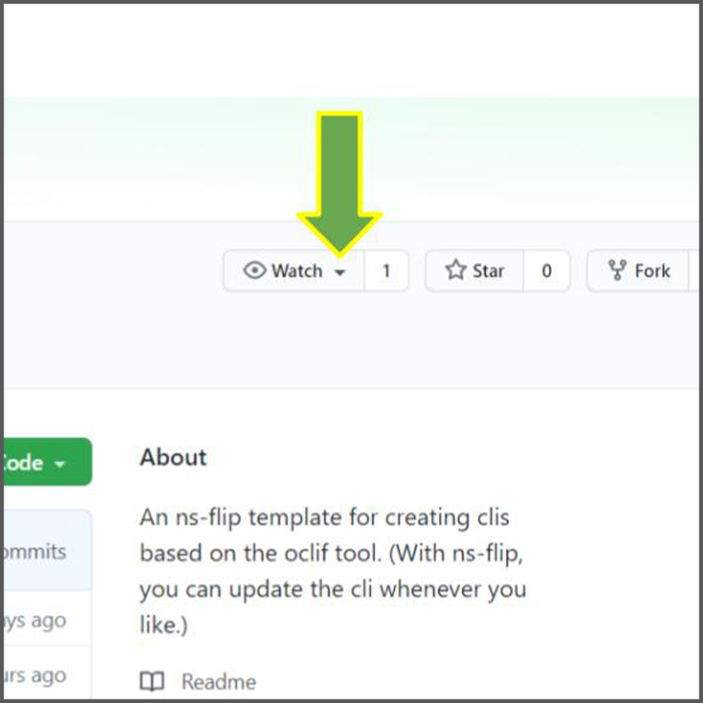
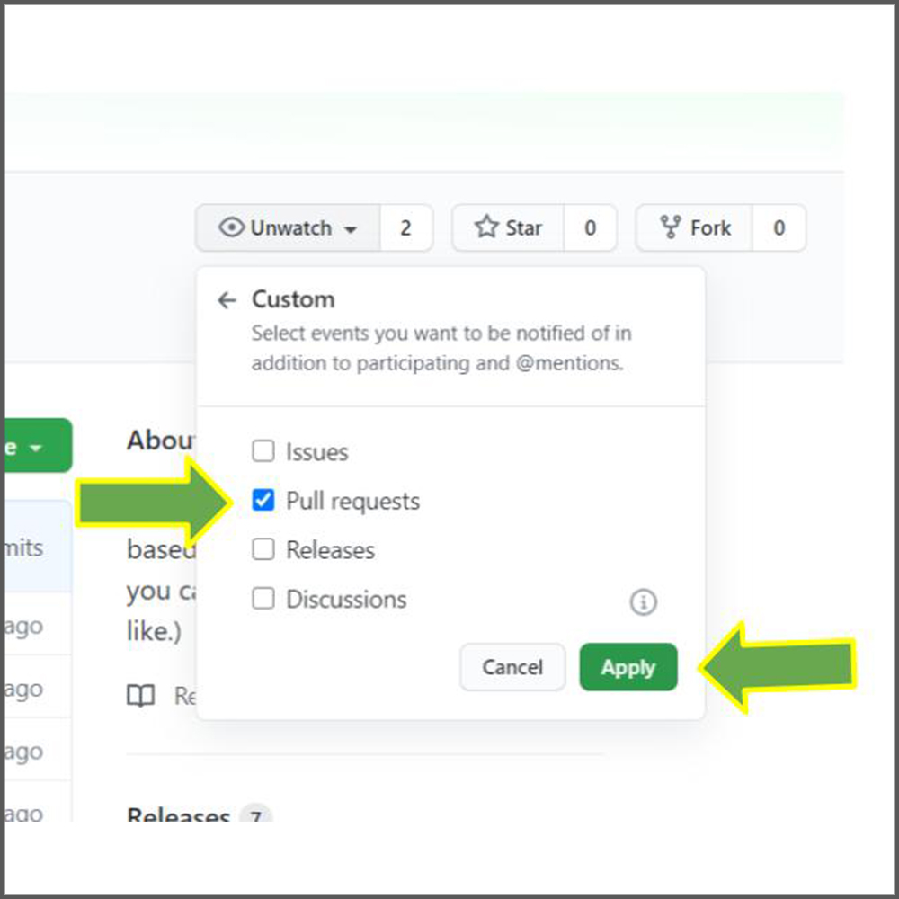

easy-oclif-cli
-----------------
Super easy cli creation and maintenance using 
[ns-flip](https://ns-flip.nostack.net/) and [oclif](https://oclif.io/).  As with any ns-flip template, you can then apply an updated version of the template and all of your own custom code will be preserved.  

# Why
The combination of the power of oclif with the simplicity of ns-flip is amazing.  You create a cli instantly and when necessary you can update the template without affecting your custom changes.

# How
Follow the steps below.  Here's a complete video:
[](http://www.youtube.com/watch?v=L_pKk148_O4)


Run
```
npx easy-oclif-cli $CODE_DIR
```
where `$CODE_DIR` is the path to your desired directory for your cli.

That will take a few minutes, and will have an interactive portion.  You will be requested by Oclif to answer a number of questions about what cli you want to create. We suggest choosing `npm` rather than the default `yarn`.

Go to [easy-oclif-cli in GitHub](https://github.com/YizYah/easy-oclif-cli) and click on "Watch" in the upper right corner to stay updated about new versions of the template.

# Run Your CLI
Try running the default cli if you like.
```
cd $CODE_DIR
npm install
npm link
```
Call the name of your cli (or whatever you put for the command name when you created it.)

# Updating the Commands
Call 
```
npx ns-flip settings $CODE_DIR
```
and follow the prompts.

Then call `generate` to update your code from the new settings:
```
npx ns-flip generate $CODE_DIR
```

# Changing Custom Code
Of course, you still have to create your code.  You should be able to just about anything in node using Typescript.  You should be able to do just about anything, but follow the [safe custom code practices of ns-flip](https://ns-flip.nostack.net/Safe-Custom-Code) to be able to reapply the template in the future.

Basically:
* For any command `command`, find it at `src/commands/command.ts`, and modify the code inside of the designated `run` area.
* Add any files or directories you like in the `src/custom` directory, and import them into the command file in the designated `customImports` section.
* You will have to modify the test code also at `test/commands/command.test.ts`.  You can also add anything you want into `test/custom`.
* Before you update your template, make sure to check your code for safety by calling:
    ``` 
    npx ns-flip check $CODE_DIR
    ```
# Updating Your Template
Take a minute and set up alerts about releases to this template.
1. Go to the [GitHub repo](https://github.com/YizYah/easy-oclif-cli) and click the arrow by the `Watch` button on the upper right.

     

2. Choose "Custom", and then select "Releases".

    

To call a newly released version just the first command again, with the same path for `$CODE_DIR`.
```
npx ns-flip settings $CODE_DIR
```
All of the settings and custom changes in the `$CODE_DIR` cli will be retained if you followed the [safe custom code practices of ns-flip](https://ns-flip.nostack.net/Safe-Custom-Code).

# Help
Post on the [ns-flip Community](https://spectrum.chat/ns-flip?tab=posts).

# See Also
* [ns-flip documentation](https://ns-flip.nostack.net/Home)
* [oclif documentation](https://oclif.io/docs/commands)

[//]: # (Image References)
[watch]: ./images/watch.jpg "Selecting Watch"
