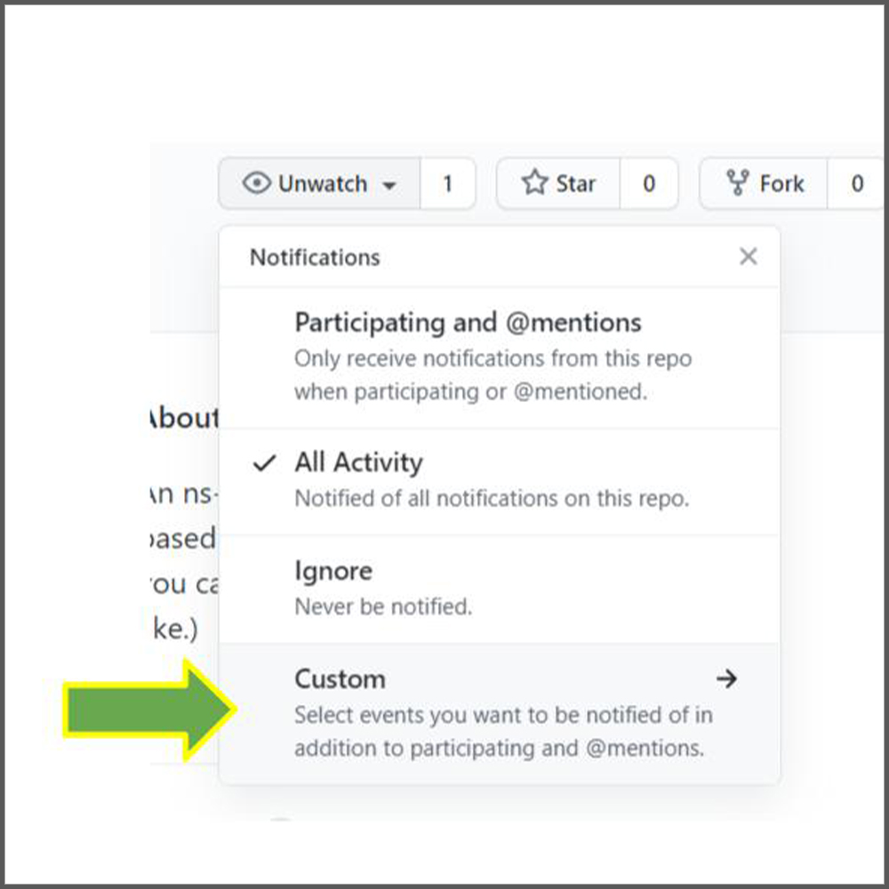

build a professional cli easily! powered by oclif and ns-flip.

# Why
The combination of the power of [oclif](https://oclif.io/) with the simple updates of [ns-flip](https://ns-flip.nostack.net/) is amazing.  You create a cli instantly and when necessary you can update the template without affecting your custom changes.

# How
Here's a 1-minute video:

[](http://www.youtube.com/watch?v=MAVN8hZpcqY)

Follow the steps below.  
## (1) Create a Starter CLI
Define `$CODE_DIR` as the path to your desired directory for your cli. Then run
```
npx easy-oclif-cli $CODE_DIR
```
and answer the interactive questions.

Then you can run it with the starter cli:
```
cd $CODE_DIR
npm install
npm link
```
Call the name of your cli (or whatever you put for the command bin name when you built it).

## (2) Update the Commands
Call 
```
npx ns-flip settings $CODE_DIR
```
and follow the prompts.

You will be prompted to regenerate your code after you make changes.  You can also call that separately:
```
npx ns-flip generate $CODE_DIR
```

After you have generated updates to your commands, you can run the `prepack` command built into [oclif](https://oclif.io) to regenerate the commands descriptions in your README:
```console
cd $CODE_DIR
npm run prepack
``` 

## (3) Change the Custom Code
Of course, you still have to create your code.  You should be able to do just about anything possible in Node using Typescript.  But, follow the [safe custom code practices of ns-flip](https://ns-flip.nostack.net/Safe-Custom-Code) to be able to reapply this template in the future without losing anything.

Basically here's what is recommended:
* Find the code for any command in the `src/commands/<commandName>.ts` file.  Modify the code inside of the designated `run` and `customImports` areas.
* Add any files or directories you like in the `src/custom` directory.
* You will have to modify the test code also at `test/commands/command.test.ts`.  You can also add anything you want into `test/custom`.

## (4) Updating Your Template
Take a minute and set up alerts about releases to this template.
1. Go to the [GitHub repo](https://github.com/YizYah/easy-oclif-cli) and click the arrow by the `Watch` button on the upper right.


2. Choose "Custom", and then select "Releases".



Before you update your template, make sure to check your code for safety by calling:
    ``` 
    npx ns-flip check $CODE_DIR
    ```
To reapply the template with a newly released version, just the first command again.  Make sure to use he same path for the legacy `$CODE_DIR`.
```
npx ns-flip settings $CODE_DIR
```
All of the settings and custom changes in the `$CODE_DIR` cli will be retained if you followed the [safe custom code practices of ns-flip](https://ns-flip.nostack.net/Safe-Custom-Code).

# Alternatives
The classic generator for creating an oclif cli is [oclif](https://www.npmjs.com/package/oclif). Both that package and this one use the same core packages, including `@oclif/command` and `@oclif/config`. Theirs offers more alternatives (e.g. yarn and js). So if you want to use js rather than ts (although they discourage the practice), you can do so with that package.  On the debit side, you can't update your template and regenerate your code without replacing your legacy changes. Also, sadly they do not seem to be maintaining it much.

  The classic node package for CLI creation is [Commander](https://www.npmjs.com/package/commander).  Commander is not a _generator_--it is a package you can include when you build a cli from scratch.  If you are interested, you can find some [Yeoman generators](https://yeoman.io/generators/) based on it--none seem to have taken off. Let us know if one works well for you.  Also, if someone wants to build a `ns-flip` generator for `Commander`, please let us know.

But, the best alternatives to `easy-oflif-cli` have not been created yet.  [Let us know](https://spectrum.chat/ns-flip?tab=posts) what you'd like to see--it's easy to create ns-flip templates! :smiley:

# Help
Post on the [ns-flip Community](https://spectrum.chat/ns-flip?tab=posts).

# See Also
* [ns-flip documentation](https://ns-flip.nostack.net/Home)
* [oclif documentation](https://oclif.io/docs/commands)
